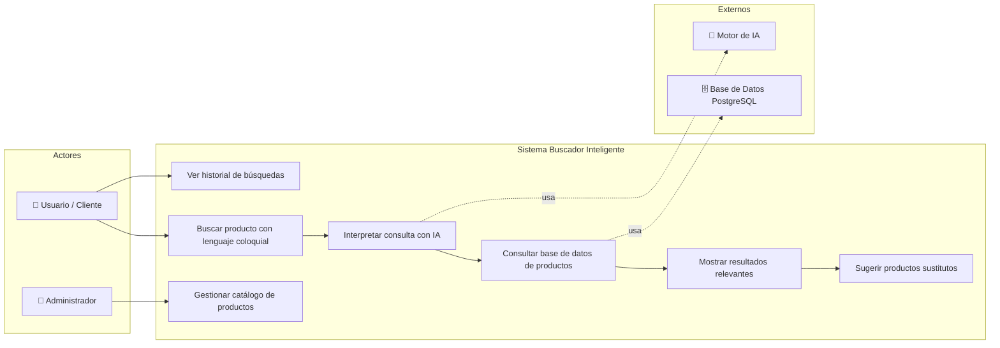
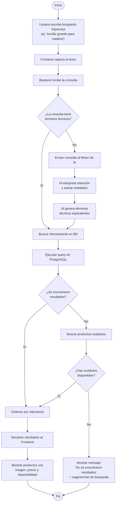
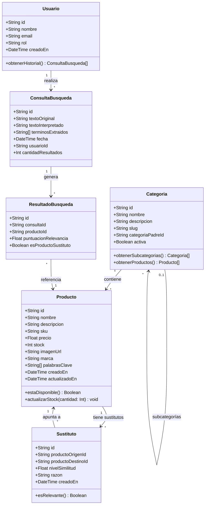
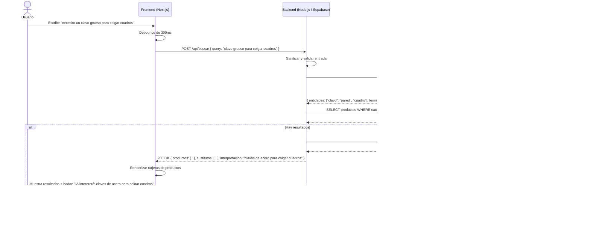

# 📐 Diagramas UML — Buscador Inteligente para Ferreterías

## 1. Diagrama de Casos de Uso

```mermaid
flowchart LR
    subgraph Actores
        U["🧑 Usuario / Cliente"]
        A["🔧 Administrador"]
    end

    subgraph Sistema["Sistema Buscador Inteligente"]
        UC1["Buscar producto con lenguaje coloquial"]
        UC2["Interpretar consulta con IA"]
        UC3["Consultar base de datos de productos"]
        UC4["Mostrar resultados relevantes"]
        UC5["Sugerir productos sustitutos"]
        UC6["Gestionar catálogo de productos"]
        UC7["Ver historial de búsquedas"]
    end

    subgraph Externos
        IA["🤖 Motor de IA"]
        BD["🗄️ Base de Datos PostgreSQL"]
    end

    U --> UC1
    UC1 --> UC2
    UC2 --> UC3
    UC3 --> UC4
    UC4 --> UC5
    U --> UC7
    A --> UC6
    UC2 -.->|usa| IA
    UC3 -.->|usa| BD
```

## 2. Diagrama de Actividades

```mermaid
flowchart TD
    A([Inicio]) --> B["Usuario escribe búsqueda imprecisa\n(ej: 'tornillo grande para madera')"]
    B --> C["Frontend captura el texto"]
    C --> D["Backend recibe la consulta"]
    D --> E{"¿La consulta tiene\ntérminos técnicos?"}

    E -- Sí --> F["Buscar directamente en BD"]
    E -- No --> G["Enviar consulta al Motor de IA"]

    G --> H["IA interpreta intención\ny extrae entidades"]
    H --> I["IA genera términos\ntécnicos equivalentes"]
    I --> F

    F --> J["Ejecutar query en PostgreSQL"]
    J --> K{"¿Se encontraron\nresultados?"}

    K -- Sí --> L["Ordenar por relevancia"]
    K -- No --> M["Buscar productos sustitutos"]
    M --> N{"¿Hay sustitutos\ndisponibles?"}

    N -- Sí --> L
    N -- No --> O["Mostrar mensaje:\n'No se encontraron resultados'\n+ sugerencias de búsqueda"]
    O --> P([Fin])

    L --> Q["Devolver resultados al Frontend"]
    Q --> R["Mostrar productos con\nimagen, precio y disponibilidad"]
    R --> P
```

## 3. Diagrama de Clases

```mermaid
classDiagram
    class Producto {
        +String id
        +String nombre
        +String descripcion
        +String sku
        +Float precio
        +Int stock
        +String imagenUrl
        +String marca
        +String[] palabrasClave
        +DateTime creadoEn
        +DateTime actualizadoEn
        +estaDisponible() Boolean
        +actualizarStock(cantidad: Int) void
    }

    class Categoria {
        +String id
        +String nombre
        +String descripcion
        +String slug
        +String categoriaPadreId
        +Boolean activa
        +obtenerSubcategorias() Categoria[]
        +obtenerProductos() Producto[]
    }

    class Sustituto {
        +String id
        +String productoOrigenId
        +String productoDestinoId
        +Float nivelSimilitud
        +String razon
        +DateTime creadoEn
        +esRelevante() Boolean
    }

    class ConsultaBusqueda {
        +String id
        +String textoOriginal
        +String textoInterpretado
        +String[] terminosExtraidos
        +DateTime fecha
        +String usuarioId
        +Int cantidadResultados
    }

    class ResultadoBusqueda {
        +String id
        +String consultaId
        +String productoId
        +Float puntuacionRelevancia
        +Boolean esProductoSustituto
    }

    class Usuario {
        +String id
        +String nombre
        +String email
        +String rol
        +DateTime creadoEn
        +obtenerHistorial() ConsultaBusqueda[]
    }

    Producto "1" --> "*" Sustituto : tiene sustitutos
    Sustituto "*" --> "1" Producto : apunta a
    Categoria "1" --> "*" Producto : contiene
    Categoria "0..1" --> "*" Categoria : subcategorías
    ConsultaBusqueda "1" --> "*" ResultadoBusqueda : genera
    ResultadoBusqueda "*" --> "1" Producto : referencia
    Usuario "1" --> "*" ConsultaBusqueda : realiza
```

## 4. Diagrama de Secuencia

```mermaid
sequenceDiagram
    actor U as Usuario
    participant FE as Frontend (Next.js)
    participant BE as Backend (Node.js / Supabase)
    participant IA as Motor de IA
    participant BD as PostgreSQL

    U->>FE: Escribe "necesito un clavo grueso para colgar cuadros"
    FE->>FE: Debounce de 300ms
    FE->>BE: POST /api/buscar { query: "clavo grueso para colgar cuadros" }

    BE->>BE: Sanitizar y validar entrada
    BE->>IA: Interpretar consulta en lenguaje natural
    IA->>IA: Procesar NLP / embeddings
    IA-->>BE: { entidades: ["clavo", "pared", "cuadro"], terminos: ["clavo de acero 2 pulgadas", "clavo con cabeza"], categoria: "clavos y fijaciones" }

    BE->>BD: SELECT productos WHERE categoria = 'clavos y fijaciones' AND similitud(embedding, query_embedding) > 0.7 ORDER BY relevancia
    BD-->>BE: [Producto1, Producto2, Producto3]

    alt Hay resultados
        BE->>BD: SELECT sustitutos WHERE producto_origen_id IN (resultados)
        BD-->>BE: [Sustituto1, Sustituto2]
        BE-->>FE: 200 OK { productos: [...], sustitutos: [...], interpretacion: "clavos de acero para colgar cuadros" }
        FE->>FE: Renderizar tarjetas de productos
        FE-->>U: Muestra resultados + badge "IA interpretó: clavos de acero para colgar cuadros"
    else No hay resultados
        BE-->>FE: 200 OK { productos: [], sugerencias: ["Prueba buscar: alcayatas, hembrillas"] }
        FE-->>U: Muestra mensaje sin resultados + sugerencias
    end
```
